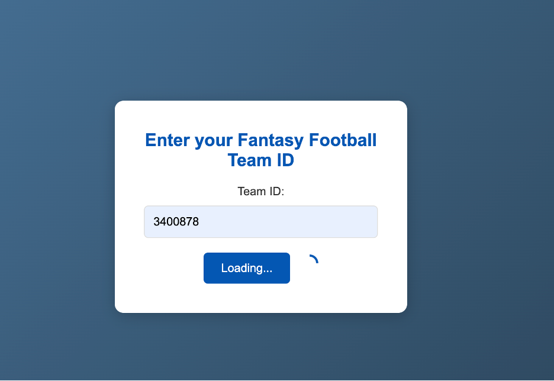
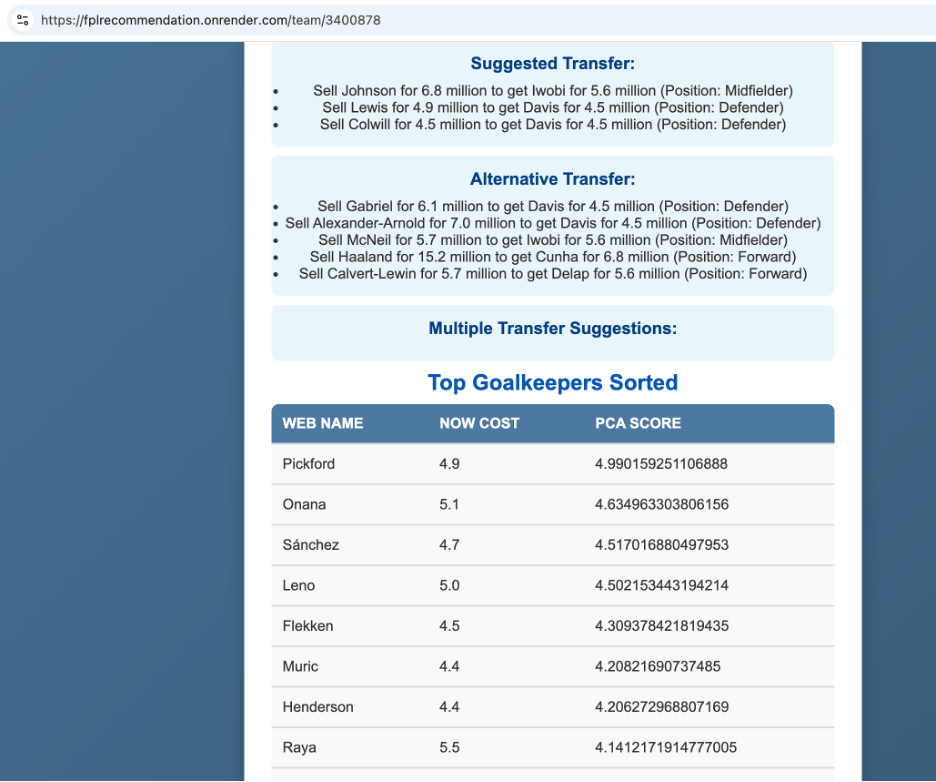
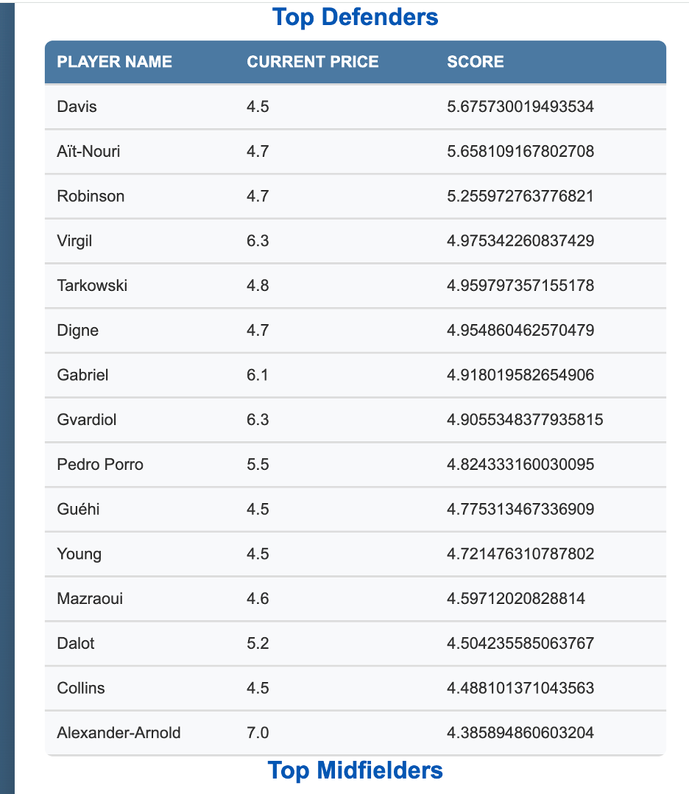

# 🚀 Transforming Fantasy Premier League (FPL) Data into Actionable Player Insights with Machine Learning 🚀

I'm thrilled to share a project that combines **machine learning** and **data engineering** to revolutionize Fantasy Premier League (FPL) transfers! This recommendation system leverages **unsupervised learning techniques**—specifically **KMeans clustering** and **Principal Component Analysis (PCA)**—to offer FPL managers deeper insights into player performance and transfer strategies.

## 🔍 Project Highlights:
- **Unsupervised Learning**: Unlike traditional supervised approaches, this project uncovers hidden patterns and relationships in the data without predefined labels, offering fresh insights into player potential.
- **Variance-Weighted PCA Scoring**: Using PCA, complex player metrics are distilled into principal components, ranked by variance-weighted scores for more effective player rankings.
- **Advanced Features**: The model incorporates a variety of features, including:
  - Goals, assists, clean sheets, minutes played
  - Bonus points, influence, creativity, threat levels
  - ICT index, fixture difficulty rating (FDR)
  - Smart-engineered features like penalty and freekick orders
- **Interactive System**: A Flask-powered app allows users to input their team ID and receive tailored transfer recommendations.

💡 **Gameweek Updates**: The tool balances historical points with fixture-adjusted potential, dynamically updating every gameweek to provide a strategic edge.

---

## 🛠️ Tech Stack
- **Python**: Core programming language
- **KMeans Clustering**: For player grouping
- **PCA**: For dimensionality reduction and scoring
- **Flask**: Backend framework for the interactive system
- **Matplotlib/Seaborn**: For data visualization
- **SQLite**: For storing player and team data

---

## 📸 Screenshots

### 1. Input Form
An interactive form where users enter their team ID to generate personalized recommendations:


### 2. Player Recommendations
A detailed list of recommended players, ranked by variance-weighted PCA scores:




### 3. Expected Points Breakdown
A visualization of expected points for each recommended player, including metrics like goals, assists, and clean sheets:


---

## 🚀 Getting Started

### Prerequisites
- Python 3.x installed
- Libraries listed in `requirements.txt`

### Installation
1. Clone the repository:
   ```bash
   git clone https://github.com/zobrathemanish/FPL-Recommendation-System.git

2. Navigate to the Project directory
    ```bash
    cd FPL-Recommendation-System 

3. Navigate to the Project directory
    ```bash
    pip install -r requirements.txt 

4. Run the Flask Application
    ```bash
    flask run 

## 📈 Key Functionalities
1. **Player Clustering**:  
   Groups players into clusters based on performance metrics to identify hidden patterns.

2. **Variance-Weighted Ranking**:  
   Uses PCA to rank players based on their variance-weighted contribution to the principal components.

3. **Fixture-Adjusted Recommendations**:  
   Balances historical performance with fixture difficulty to suggest optimal transfers.

---

## 📢 Final Thoughts
This project is designed to empower FPL managers with a strategic edge, offering actionable insights that balance historical data and future potential. Whether you're aiming to dominate your mini-league or climb the global leaderboard, this recommendation system provides the tools you need to make data-driven decisions.

---

Check out the repository: **[FPL Recommendation System](https://github.com/zobrathemanish/FPL-Recommendation-System)**  
Happy managing! ⚽


